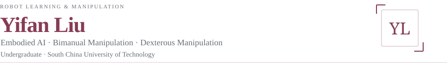
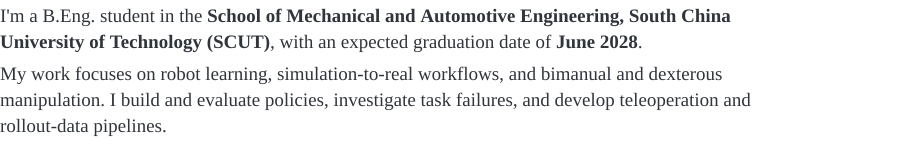
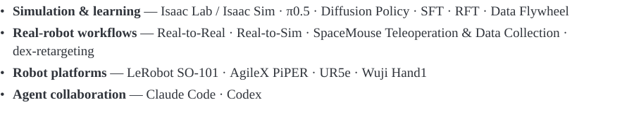

 &nbsp;  &nbsp; 

 
<picture><source media="(max-width: 600px)" srcset="https://raw.githubusercontent.com/sudo-yf/sudo-yf/main/assets/serif-compact/about-mobile.svg"></picture>
 

 

 
<picture><source media="(max-width: 600px)" srcset="https://raw.githubusercontent.com/sudo-yf/sudo-yf/main/assets/serif-compact/slai-mobile.svg"></picture>
 
<picture><source media="(max-width: 600px)" srcset="https://raw.githubusercontent.com/sudo-yf/sudo-yf/main/assets/serif-compact/miaa-mobile.svg"></picture>
 

 

 
<picture><source media="(max-width: 600px)" srcset="https://raw.githubusercontent.com/sudo-yf/sudo-yf/main/assets/serif-compact/robosyn-mobile.svg"></picture>
 
 
<picture><source media="(max-width: 600px)" srcset="https://raw.githubusercontent.com/sudo-yf/sudo-yf/main/assets/serif-compact/wrist-mobile.svg"></picture>
 
<picture><source media="(max-width: 600px)" srcset="https://raw.githubusercontent.com/sudo-yf/sudo-yf/main/assets/serif-compact/lehome-mobile.svg"></picture>
 
 &nbsp;  

 

 
<picture><source media="(max-width: 600px)" srcset="https://raw.githubusercontent.com/sudo-yf/sudo-yf/main/assets/serif-compact/skills-mobile.svg"></picture>
 

 

 
<picture><source media="(max-width: 600px)" srcset="https://raw.githubusercontent.com/sudo-yf/sudo-yf/main/assets/serif-compact/education-mobile.svg"></picture>
 

 

